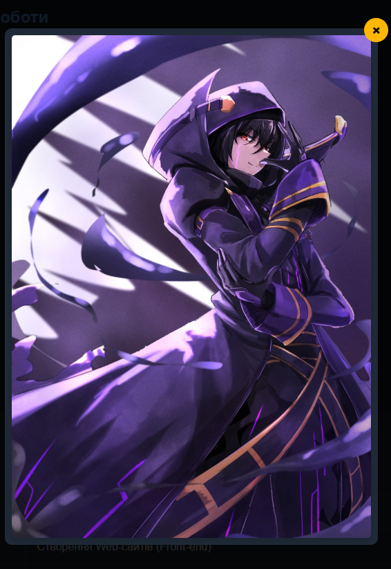
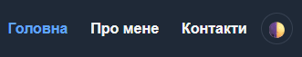
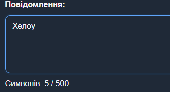

# Практична робота: Інтерактивний веб-сайт (JavaScript)

**Автор:** Юрчик Владислав Сергійович (Frezze)
**Дисципліна:** Створення Web-сайтів (Front-end)

## 📌 Опис проекту
Цей проект є логічним продовженням мого першого HTML/CSS сайту. У цій практичній роботі я "оживив" сторінки за допомогою мови програмування JavaScript, додавши інтерактивні елементи, роботу з DOM-деревом, обробку подій та використання локального сховища браузера (Local Storage).

## 🚀 Реалізований функціонал (JavaScript)

1. **Динамічна навігація:** - Скрипт автоматично визначає поточну URL-адресу та підсвічує активний пункт меню в шапці сайту.
2. **Зміна теми (Світла/Темна):** - Реалізовано перемикач тем. Вибір користувача зберігається у `localStorage`, тому тема не скидається при оновленні сторінки.
3. **Модальне вікно (Popup):** - При кліку на фото профілю відкривається модальне вікно з повнорозмірним зображенням. Під час відкритого вікна блокується прокрутка (`overflow: hidden`).
4. **Акордеон (FAQ):** - Створено інтерактивний список навичок, який плавно розгортається/згортається при кліку на заголовок.
5. **Валідація форми та лічильник символів:** - На сторінці "Контакти" додано динамічний лічильник введених символів для поля `textarea` (з обмеженням у 500 символів).
6. **Збереження чернетки форми:** - Текст, який вводиться у повідомлення, автоматично зберігається в `localStorage` (подія `input`). Якщо випадково закрити сторінку, текст відновиться при наступному візиті.
7. **Кнопка "Вгору":** - Кнопка з'являється лише після прокручування сторінки вниз (подія `scroll`) і плавно повертає користувача на початок сторінки.
8. **Обробка даних форми:**
    - Перехоплення стандартної події відправки (`e.preventDefault()`), збір даних через об'єкт `FormData` та виведення вітального повідомлення без перезавантаження сторінки.
9. **Динамічний футер:** - Поточний рік у підвалі сайту генерується автоматично за допомогою об'єкта `Date()`.

## 🛠 Технології
- HTML5 (Семантична розмітка)
- CSS3 (Flexbox, CSS-змінні, анімації `transition`, медіа-запити)
- JavaScript (ES6+, DOM Manipulation, Event Listeners, Web Storage API)

## 📸 Скріншоти роботи

