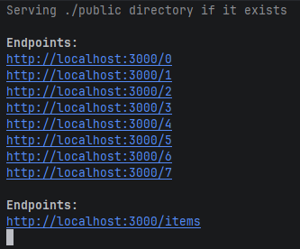
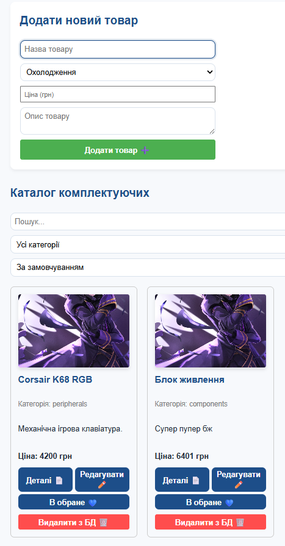
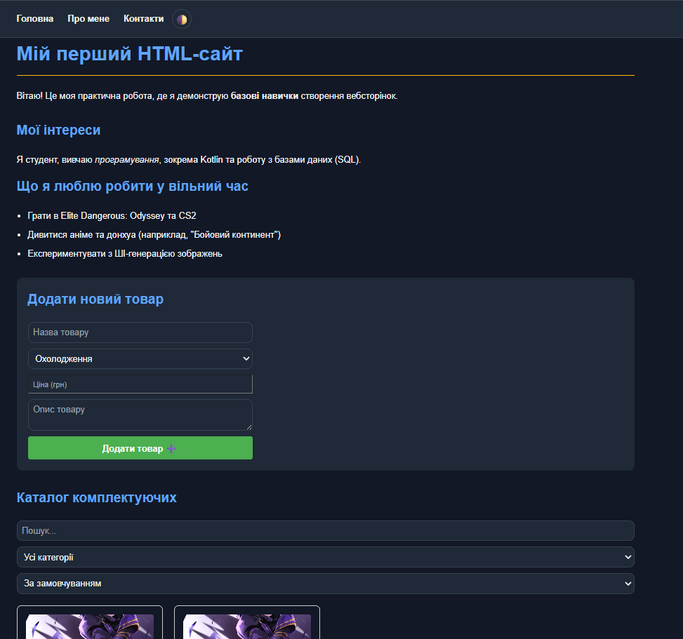
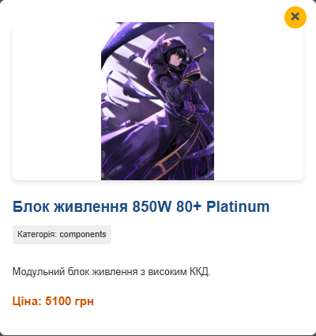

# Практична робота: Взаємодія з REST API та CRUD-операції (JavaScript)

**Автор:** Юрчик Владислав Сергійович
**Дисципліна:** Створення Web-сайтів (Front-end)

## 📌 Опис проєкту
Цей проєкт є фінальним етапом розробки інтерактивного каталогу. Основна увага приділена взаємодії фронтенд-частини із сервером через REST API. Дані більше не є статичними: вони зберігаються у локальній базі даних `db.json` і керуються через HTTP-запити.

## 🚀 Реалізований CRUD-функціонал

### 1. Взаємодія із сервером (REST API)
* **Джерело даних:** Локальний мок-сервер на базі `json-server`.
* **Асинхронність:** Усі запити реалізовані через `fetch()` з використанням `async/await`.
* **Стани інтерфейсу:** Реалізовано відображення процесів завантаження, обробку помилок сервера та повідомлення про успішне виконання операцій.

### 2. Керування даними (CRUD)
* **READ (GET):** Отримання повного списку товарів та динамічне відображення карток.
* **CREATE (POST):** Додавання нових позицій до каталогу через інтерактивну форму з клієнтською валідацією даних.
* **UPDATE (PATCH):** Редагування наявних записів. При натисканні на кнопку дані підтягуються у форму для корекції.
* **DELETE (DELETE):** Видалення товарів із бази даних із попереднім підтвердженням дії (confirm).

### 3. Додаткові можливості
* **Пошук та фільтрація:** Живий пошук за назвою та фільтр за категоріями.
* **Система "Обране":** Збереження вподобань у `localStorage`.
* **Адаптивність:** Інтерфейс коректно відображається на різних типах пристроїв.

## 🛠 Технології
- JavaScript (ES6+), DOM API
- REST API (JSON Server)
- Fetch API, Асинхронне програмування
- LocalStorage

## ⚙️ Як запустити проєкт локально
1. Встановіть Node.js.
2. Встановіть json-server: `npm install -g json-server`.
3. Запустіть сервер у папці проєкту:
   ```bash
   json-server --watch db.json --port 3000

## 📸 Скріншоти роботи

### Робота з сервером та базою даних




### Базовий інтерфейс

