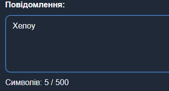
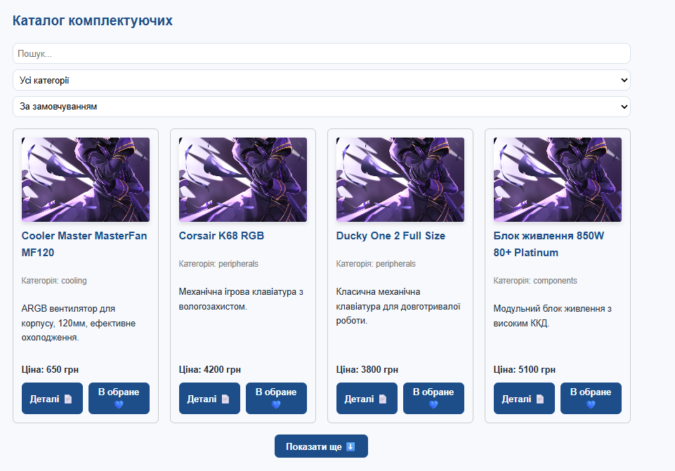

# Практична робота: Інтерактивний вебсайт та Асинхронні дані (JavaScript)

**Автор:** Юрчик Владислав Сергійович

**Дисципліна:** Створення Web-сайтів (Front-end)

## 📌 Опис проєкту
Цей проєкт є логічним продовженням мого першого HTML/CSS сайту. У цих практичних роботах я "оживив" сторінки за допомогою мови програмування JavaScript. Проєкт еволюціонував від базових DOM-маніпуляцій до data-driven підходу: тепер сайт вміє асинхронно завантажувати дані, рендерити каталог, обробляти пошук та фільтрацію, а також працювати з локальним сховищем.

## 🚀 Реалізований функціонал (JavaScript)

### Базова інтерактивність (DOM та Події)
1. **Динамічна навігація:** Скрипт автоматично визначає поточну URL-адресу та підсвічує активний пункт меню в шапці сайту.
2. **Зміна теми (Світла/Темна):** Реалізовано перемикач тем. Вибір користувача зберігається у `localStorage`.
3. **Модальне вікно (Popup):** При кліку на фото профілю відкривається модальне вікно. Під час відкритого вікна блокується прокрутка (`overflow: hidden`).
4. **Акордеон (FAQ):** Інтерактивний список навичок, який плавно розгортається/згортається.
5. **Робота з формами:** Валідація, лічильник символів (до 500), збереження чернетки повідомлення у `localStorage` та обробка відправки через `FormData`.
6. **Кнопка "Вгору":** З'являється після прокручування сторінки та плавно повертає на початок.
7. **Динамічний футер:** Поточний рік генерується автоматично.

### Асинхронна робота з даними (Fetch API та JSON)
8. **Завантаження даних:** Асинхронне отримання списку товарів з локального файлу `items.json` за допомогою `fetch()` та `async/await`.
9. **Динамічний рендеринг:** Генерація карток каталогу на основі масиву об'єктів (без дублювання HTML-коду).
10. **Пошук, фільтрація та сортування:** Живий пошук за назвою та описом, фільтр за категоріями та сортування за ціною. Працюють у реальному часі без перезавантаження сторінки.
11. **Пагінація (Кнопка "Показати ще"):** Поступове відображення карток (по 4 елементи) для оптимізації інтерфейсу.
12. **Система "Обране":** Можливість зберігати вподобані товари у `localStorage` (зміна тексту кнопки при додаванні/видаленні).
13. **Деталі товару:** Динамічне модальне вікно, яке підтягує та відображає повну інформацію про конкретний товар при кліку на кнопку "Деталі".
14. **Обробка станів UI:** Коректне відображення станів завантаження (loading), порожнього результату при пошуку (empty state) та обробка помилок (error state).

## 🛠 Технології
- HTML5 (Семантична розмітка)
- CSS3 (Flexbox, CSS-змінні, анімації, медіа-запити)
- JavaScript (ES6+, DOM Manipulation, Event Listeners)
- Fetch API, JSON, Async/Await
- Web Storage API (LocalStorage)

## 📸 Скріншоти роботи

### Базовий інтерфейс

### Каталог та Асинхронні дані

